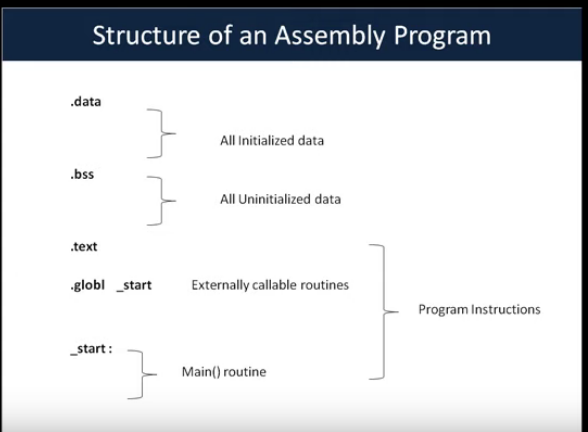

# hello world

**structure of assembly program**



**Linux system calls:**
Programs use system calls to perform a variety of operations such as: creating processes, doing network and file IO, and much more.

- list of system calls available in /usr/include/asm/unistd.h

- E.g. exit(), read(), write() etc. which used in programming in C

- system calls are invoked by processes using a software interrupt - INT 0x80

##### *How to pass arg to syscalls?*

- EAX : system call number
- EBX : first arg
- ECX : secon arg
- EDX : third arg
- ESI : fourth arg
- EDI : fifth arg

##### *How system call invoke to assembly*

eg :in this example we call exit() syscall.

- function def for exit()
		void_exit(int status);

1. first we find syscall number.for find syscal cat the `/usr/include/asm/unistd.h` file. for exit() syscall number is 1. so we load 1 in EAX.

		movl $1,%eax

2. next void_exit() need arg status. lets say art '0'. then we load that in EBX.

		movl $0, %ebx

3. next calling syscall itself and that is done by Raise the software interrupt 0x80

		int 0x80


simple program which just exists

```asm
.text

.global _start

_start:
        movl $1,%eax
        movl $0,%ebx
        int $0x80
```

##### writing hello world program

to print "hello world" we use write() syscall. and then use exit() syscall to exit the program

write() syscall description:

>ssize_t write(int fd, const void *buf, size_t count)


		syscall number for write is 4 which stored in EAX

		fd : file descriptor. 1 for stdout stored in EBX

		buf : pointer to memory location containing "hello world" strng (in ECX)

		Count : string length (in EDX)

##### hello world program :

```asm
.data                                                                                                          [2/67]

helloString:
        .ascii "hello world"                              

.global _start 

_start:
        # calling write syscall
        # moving write syscall number 4 into eax
        movl $4,%eax

        # move fd(file discriptor) to ebx
        movl $1,%ebx

        # point to helloString
        movl $helloString,%ecx

        # string length.
        movl $11,%edx

        # calling interrupt
        int $0x80

        # for exit the program need to call exit syscall
        movl $1,%eax
        movl $0,%ebx
        int $0x80

 ```


