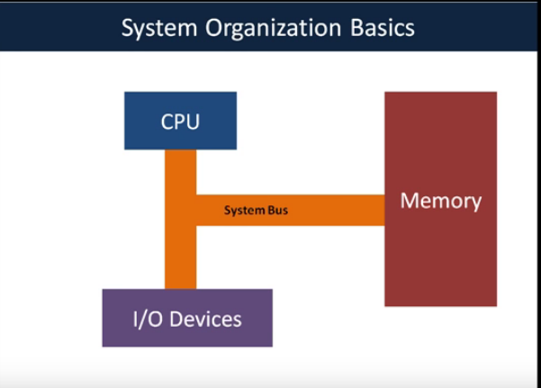
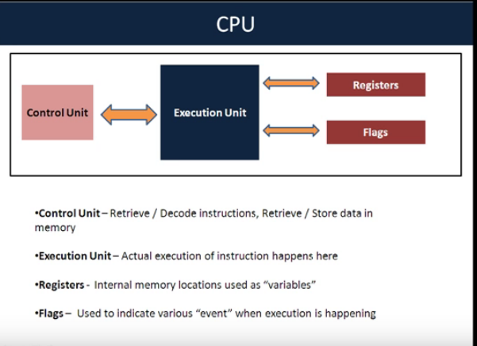
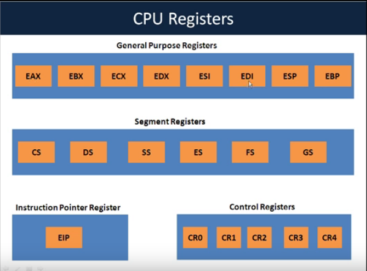
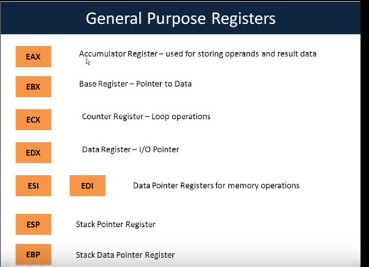
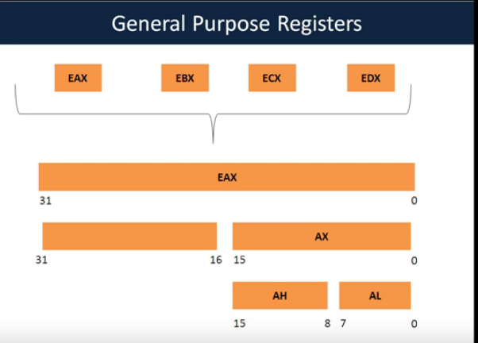
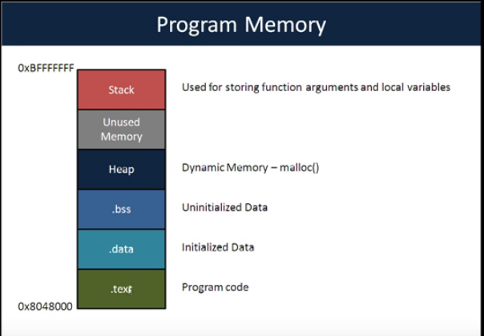
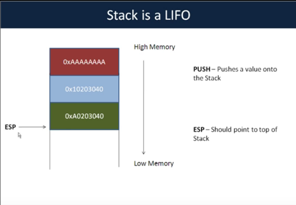

# 1.System Organization

in any computer system we have a cpu, memory and i/o devices. this basic building blocks communicate with system bus.

**CPU**

- 4 part

1. control unit 
2. execution unit
3. registers
4. flags

**CPU Registers**

- general purpose register used for various calculations happening in cpu.

- segment registers 
	CS : code segment
	DS : data segment
	SS : stack segment
	ES : pointer used for other segment
	FS : pointer used for other segment
	GS : pointer used for other segment.

- Instruction pointer register (ESP): most important from exploation perspective. because it point to instruction which cpu executing this time.

- control register : CR0 , CR1 ..CR4  used for various calculations.

*General purpose register* : 

Properties that EAX , EBX, ECX and EDX share:

its possible to access first 15 bit of EAX by referrencing as AX

and its further possible to access 8-8 bits by AH and AL

similar for EBX,ECX and EDX

this 4 reg allow selective acces to there lower bit. 

**Memory**

*virtual memory module*

every process is laid out in the same virtual memory space-regardless of the physical memory location.

every process is feels that it is in the system alone and enjoys all resources and that no other processes exist.

the os and cpu together maintain this abstraction.

- Program memory :

.text : acutal program . laid out in lowest in memory

.data : any data which initialized with value store here.

.bss : uninitialized data.

heap : dynamic memory 

unused memory 

stack : used for storing function arguments and local variables.

* stack :

- its LIFO
- esp should poinsts top of the stack.
- push : push value in stack
- when we push value in stack esp  update the value and point to top.
- pop : remove the topmost value.
- when we pop value in stack the esc update.

