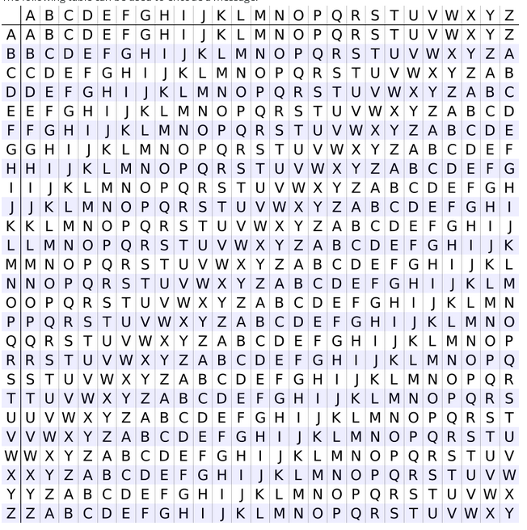

# ctf > 101

**Used for**

* Securing web traffic (passwords, communication, etc.)
* Securing copyrighted software code
* Hiding malicious communication
* Hiding malicious code

## Topics covered in this note.

1. XOR
2. Cesear Cipher
3. Substitution Cipher
4. Vigenere Cipher
5. Hashing Functions
6. Block Ciphers
7. Stream Ciphers
8. RSA

## XOR :

An XOR or eXclusive OR is a bitwise operation indicated by ^ and shown by the following truth table:

A | B | A^B
--|---|-----
0 | 0 | 0
0 | 1 | 1
1 | 0 | 1
1 | 1 | 0

**Exploiting XOR Encryption**

*Single Byte XOR Encryption*

Single Byte XOR Encryption is trivial to bruteforce as there are only 255 key combinations to try.
Multibyte XOR Encryption

Multibyte XOR gets exponentially harder the longer the key, but if the encrypted text is long enough, character frequency analysis is a viable method to find the key. Character Frequency Analysis means that we split the cipher text into groups based on the number of characters in the key. These groups then are bruteforced using the idea that some letters appear more frequently in the english alphabet than others.

## Caesar Cipher/ROT 13

The Caesar Cipher or Caesar Shift is a cipher which uses the alphabet in order to encode texts.

CAESAR encoded with a shift of 8 is KIMAIZ so ABCDEFGHIJKLMNOPQRSTUVWXYZ becomes IJKLMNOPQRSTUVWXYZABCDEFGH

ROT13 is the same thing but a fixed shift of 13, this is a trivial cipher to bruteforce because there are only 25 shifts.

## Substitution Cipher

A Substitution Cipher is system of encryption where different symobls substitute a normal alphabet.

similar to caesar cipher but you can choose which letter substitute the alphabet.

## Vigenere Cipher

A Vigenere Cipher is an extended Caesar Cipher where a message is encrypted using various Caesar shifted alphabets.

following table can be used to encode msg.

## Hashing Functions

Hashing functions are one way functions which theoretically provide a unique output for every input. MD5, SHA-1, and other hashes which were considered secure are now found to have collisions or two different pieces of data which produce the same supposed unique output.
String Hashing

A string hash is a number or string generated using an algorithm that runs on text or data.

The idea is that each hash should be unique to the text or data (although sometimes it isn’t). For example, the hash for “dog” should be different from other hashes.

You can use command line tools tools or online resources such as this one. Example: $ echo -n password | md5 5f4dcc3b5aa765d61d8327deb882cf99 Here, “password” is hashed with different hashing algorithms:

    SHA-1: 5BAA61E4C9B93F3F0682250B6CF8331B7EE68FD8
    SHA-2: 5E884898DA28047151D0E56F8DC6292773603D0D6AABBDD62A11EF721D1542D8
    MD5: 5F4DCC3B5AA765D61D8327DEB882CF99
    CRC32: BBEDA74F

Generally, when verifying a hash visually, you can simply look at the first and last four characters of the string.
File Hashing

A file hash is a number or string generated using an algorithm that is run on text or data. The premise is that it should be unique to the text or data. If the file or text changes in any way, the hash will change.

What is it used for? - File and data identification - Password/certificate storage comparison

How can we determine the hash of a file? You can use the md5sum command (or similar).

$ md5sum samplefile.txt
3b85ec9ab2984b91070128be6aae25eb samplefile.txt

Hash Collisions

A collision is when two pieces of data or text have the same cryptographic hash. This is very rare.

What’s significant about collisions is that they can be used to crack password hashes. Passwords are usually stored as hashes on a computer, since it’s hard to get the passwords from hashes.

If you bruteforce by trying every possible piece of text or data, eventually you’ll find something with the same hash. Enter it, and the computer accepts it as if you entered the actual password.