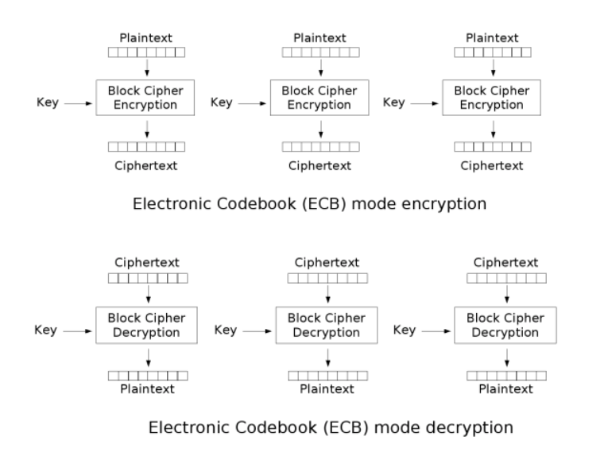
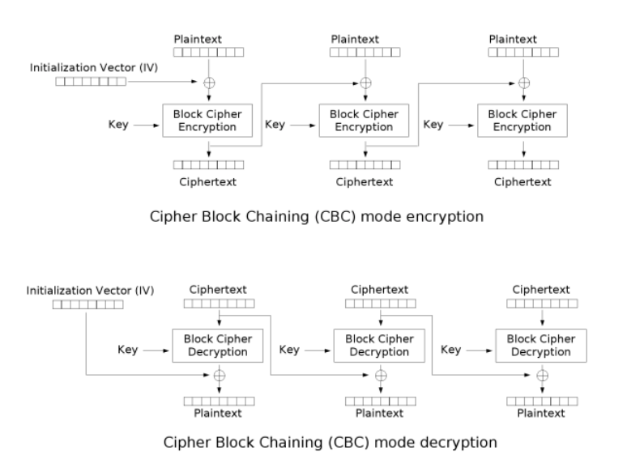
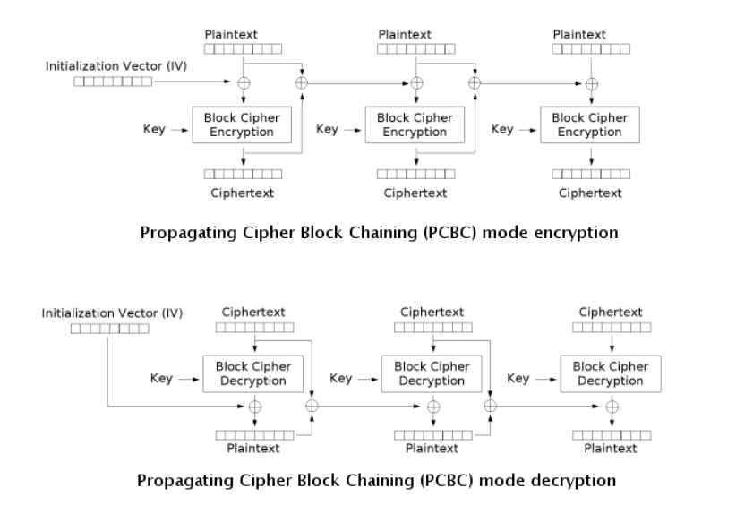

# ctf101

> Mr.cyber7ron

> source: https://ctf101.org/cryptography/overview/

**Used for**

* Securing web traffic (passwords, communication, etc.)
* Securing copyrighted software code
* Hiding malicious communication
* Hiding malicious code

## Topics covered in this note.

1. XOR
2. Cesear Cipher
3. Substitution Cipher
4. Vigenere Cipher
5. Hashing Functions
6. Block Ciphers
7. Stream Ciphers
8. RSA

## XOR :

An XOR or eXclusive OR is a bitwise operation indicated by ^ and shown by the following truth table:

A | B | A^B
--|---|-----
0 | 0 | 0
0 | 1 | 1
1 | 0 | 1
1 | 1 | 0

**Exploiting XOR Encryption**

*Single Byte XOR Encryption*

Single Byte XOR Encryption is trivial to bruteforce as there are only 255 key combinations to try.
Multibyte XOR Encryption

Multibyte XOR gets exponentially harder the longer the key, but if the encrypted text is long enough, character frequency analysis is a viable method to find the key. Character Frequency Analysis means that we split the cipher text into groups based on the number of characters in the key. These groups then are bruteforced using the idea that some letters appear more frequently in the english alphabet than others.

## Caesar Cipher/ROT 13

The Caesar Cipher or Caesar Shift is a cipher which uses the alphabet in order to encode texts.

CAESAR encoded with a shift of 8 is KIMAIZ so ABCDEFGHIJKLMNOPQRSTUVWXYZ becomes IJKLMNOPQRSTUVWXYZABCDEFGH

ROT13 is the same thing but a fixed shift of 13, this is a trivial cipher to bruteforce because there are only 25 shifts.

## Substitution Cipher

A Substitution Cipher is system of encryption where different symobls substitute a normal alphabet.

similar to caesar cipher but you can choose which letter substitute the alphabet.

## Vigenere Cipher

A Vigenere Cipher is an extended Caesar Cipher where a message is encrypted using various Caesar shifted alphabets.

following table can be used to encode msg.

## Hashing Functions

Hashing functions are one way functions which theoretically provide a unique output for every input. MD5, SHA-1, and other hashes which were considered secure are now found to have collisions or two different pieces of data which produce the same supposed unique output.
String Hashing

A string hash is a number or string generated using an algorithm that runs on text or data.

The idea is that each hash should be unique to the text or data (although sometimes it isn’t). For example, the hash for “dog” should be different from other hashes.

You can use command line tools tools or online resources such as this one. Example: $ echo -n password | md5 5f4dcc3b5aa765d61d8327deb882cf99 Here, “password” is hashed with different hashing algorithms:

    SHA-1: 5BAA61E4C9B93F3F0682250B6CF8331B7EE68FD8
    SHA-2: 5E884898DA28047151D0E56F8DC6292773603D0D6AABBDD62A11EF721D1542D8
    MD5: 5F4DCC3B5AA765D61D8327DEB882CF99
    CRC32: BBEDA74F

Generally, when verifying a hash visually, you can simply look at the first and last four characters of the string.
File Hashing

A file hash is a number or string generated using an algorithm that is run on text or data. The premise is that it should be unique to the text or data. If the file or text changes in any way, the hash will change.

What is it used for? - File and data identification - Password/certificate storage comparison

How can we determine the hash of a file? You can use the md5sum command (or similar).

$ md5sum samplefile.txt
3b85ec9ab2984b91070128be6aae25eb samplefile.txt

Hash Collisions

A collision is when two pieces of data or text have the same cryptographic hash. This is very rare.

What’s significant about collisions is that they can be used to crack password hashes. Passwords are usually stored as hashes on a computer, since it’s hard to get the passwords from hashes.

If you bruteforce by trying every possible piece of text or data, eventually you’ll find something with the same hash. Enter it, and the computer accepts it as if you entered the actual password.

## Block Ciphers

A block cipher takes a block of plaintext bits and generates a block of ciphertext bits, generally of same size. The size of block is fixed in the given scheme. The choice of block size does not directly affect to the strength of encryption scheme. The strength of cipher depends up on the key length.

**Definitions**

*Mode of Operation*: How a block cipher is applied to an amount of data which exceeds a block's size

*Initialization Vector (IV)*: A sequence of bytes which is used to randomize encryption even if the same plaintext is encrypted

*Starting Variable (SV)*: Similar to the IV, except it is used during the first block to provide a random seed during encryption

*Padding*: Padding is used to ensure that the block sizes all line up and ensure the last block fits the block cipher

*Plaintext*: Unencrypted text; Data without obfuscation

*Key*: A secret used to encrypt plaintext

*Ciphertext*: Plaintext encrypted with a key

**Electronic Codebook (ECB)**

ECB is the most basic block cipher, it simply chunks up plaintext into blocks and independently encrypts those blocks and chains them all into a ciphertext.

**Cipher Block Chaining (CBC)**

CBC is an improvement upon ECB where an Initialization Vector is used in order to add randomness. The encrypted previous block is used as the IV for each sequential block meaning that the encryption process cannot be parallelized.

**NOTE**

*in CBC encyption process cannot be parallized but decryption can be. if wrong IV is used for decrypt the first block it will affect the first block and all other block depends upon the first block cipher text the decryption process will be parallelized.*

**Propogating Cipher Block Chaining (PCBC)**

PCBC is a less used cipher which modifies CBC so that decryption is also not parallelizable , both the plaintext and ciphertext are used when encrypting or decrypting as seen in the images below.

**Padding Oracle Attack**

abusing a block cipher by changing the length of input and being able to determine the plaintext.

Requirements

    An oracle, or program, which encrypts data using CBC
    Continual use of the same key

Execution

    If we have two blocks of ciphertext, C1 and C2, we can get the plaintext P2
    Since we know that CBC decryptionis dependent on the prior ciphertext, if we change the last byte of C1 we can see if C2 has correct padding
    If it is correctly padded we know that the last byte of the plaintext
    If not, we can increase our byte by one and repeat until we have a successful padding
    We then repeat this for all successive bytes following C1 and if the block is 16 bytes we can expect a maximum of 4080 attempts which is trivial

## Stream Ciphers

A Stream Cipher is used for symmetric key cryptography, or when the same key is used to encrypt and decrypt data.

**Definitions**

*keystream*:  a keystream is a stream of random or pseudorandom characters that are combined with a plaintext message to produce an encrypted message 

**one time pad**

its a encryption mechanism whereby entire plain text is XOR'd with a key to generate cipher text.

The advantage of the one time pad is that it offers an immense amount of security BUT in order for it to be useful, the randomly generated key must be distributed on a separate secure channel

**Types of Stream Ciphers**

1. Synchronous Stream Ciphers

A Synchronous Stream Cipher generates a keystream based on internal states not related to the plaintext or ciphertext. This means that the stream is generated pseudorandomly outside of the context of what is being encrypted.

2. asynchronous stream cipher

A Self-synchronizing Stream Cipher, also known as an asynchronous stream cipher or ciphertext autokey (CTAK), is a stream cipher which uses the previous N digits in order to compute the keystream used for the next N characters.

## RSA

** LEARN FORM YOUTUBE **