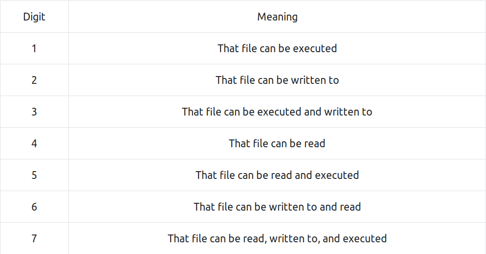

# Permissions

**File Permission**

> drwxr-xr-x 2 pete penguins 4096 Dec 1 11:45

there are four parts of files's permission.

		d | rwx | r-x | r-x 

1. first part denotes file type. d for dir and - for normal file.

2. next three parts of the file mode are actual permissions for

		users | group | other

- r : readble
- w : writeable
- x : executable
- - : empty(no permission)

**Modifying permission**

we can change permission by `chmod` cmd.

		chmod 600 file_name

- numerical representation of permission:

**setuid**

There are many cases in which normal users need elevated access to do stuff. The system administrator can't always be there to enter in a root password every time a user needed access to a protected file, so there are special file permission bits to allow this behavior. The Set User ID (SUID) allows a user to run a program as the owner of the program file rather than as themselves.

- set suid bit to file
		
		sudo chmod 4755 file_name

**Process Permissions**s